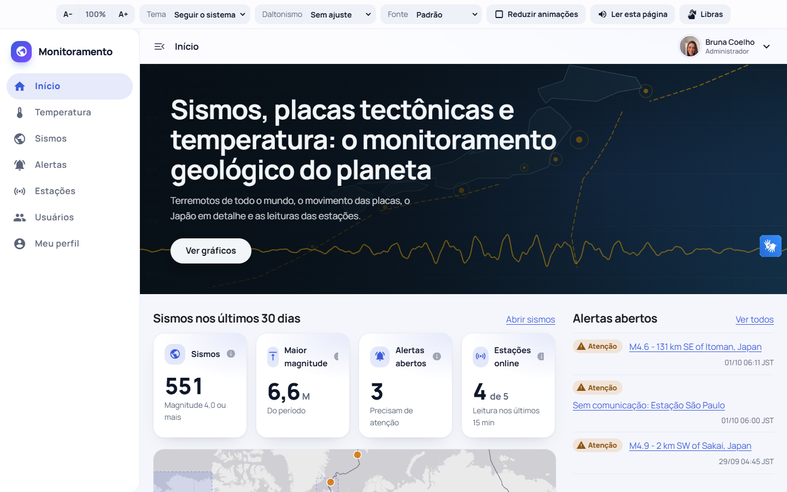
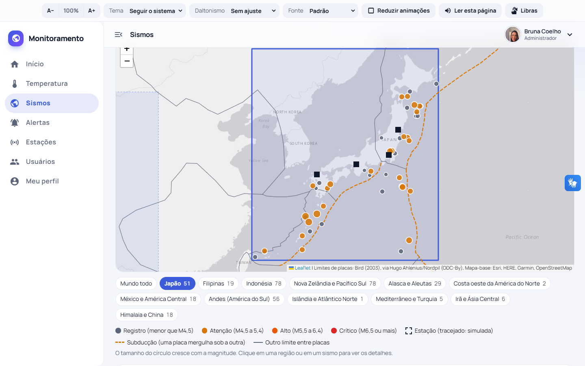
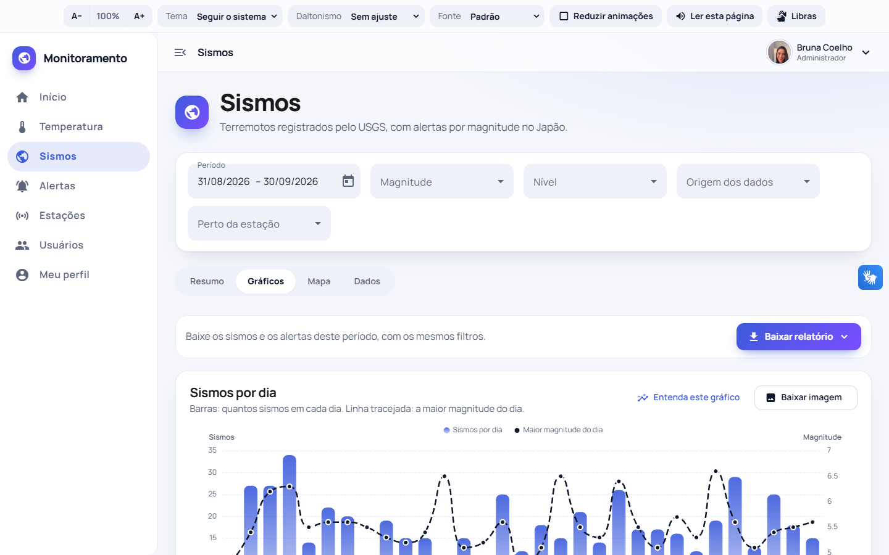
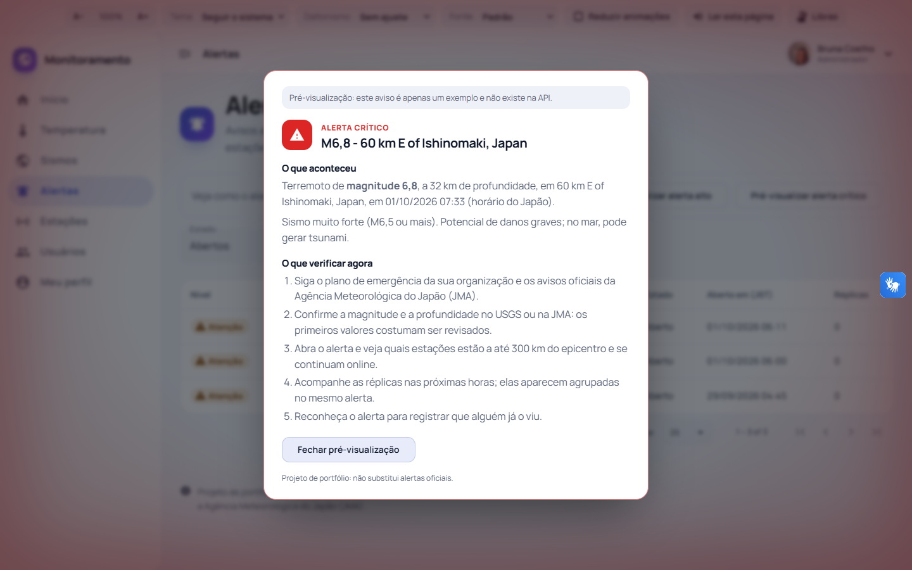
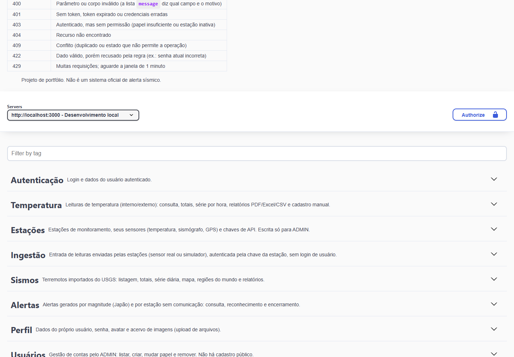
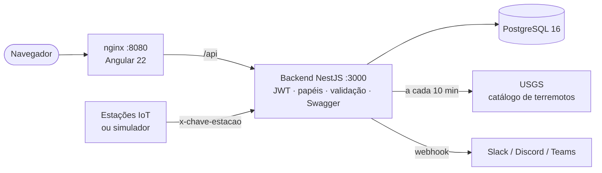

# Monitoramento geológico: terremotos, placas tectônicas e temperatura

[](https://github.com/Brunacoelhob/app-monitoramento-geologico/actions/workflows/ci.yml)


Sistema completo de monitoramento: **terremotos do mundo todo** (USGS, com o Japão em detalhe), **limites reais entre as placas tectônicas**, **alertas por magnitude** e **estações IoT** com sismógrafo, GPS e sensores de temperatura. O backend concentra toda a regra de negócio, autenticação e validação; o frontend é um painel acessível e responsivo.

> Projeto de portfólio. **Não é um sistema oficial de alerta sísmico.** Para alertas oficiais, consulte a Agência Meteorológica do Japão (JMA). Todo dado simulado aparece sempre identificado como **Simulado**.



<table>
  <tr>
    <td></td>
    <td></td>
  </tr>
  <tr>
    <td></td>
    <td></td>
  </tr>
</table>

## O que o sistema faz

- **Sismos:** importa terremotos do USGS a cada 10 minutos (Japão M4,0+ e mundo M4,5+). Filtros por período (calendário, atalhos de 7/30/90 dias ou **arrastando o mouse sobre a linha do tempo**), magnitude, nível, origem, região e proximidade de uma estação. Resumo, gráficos, mapa e tabela, com exportação em **PDF, Excel e CSV**.
- **Mapa-múndi clicável:** 12 regiões sísmicas com contagem de eventos, placas envolvidas e um texto de contexto geológico; limites de placas reais (subducção em destaque).
- **Alertas:** gerados por magnitude **apenas em regiões monitoradas** (hoje, o Japão): Atenção (M4,5), Alto (M5,5), Crítico (M6,5). Agrupam réplicas, têm histórico completo e fluxo *aberto → reconhecido → encerrado*. Também há alerta de **estação sem comunicação**.
- **Alarme em tela cheia:** alertas Alto/Crítico acendem uma luz vermelha suave nas bordas e um aviso com *o que aconteceu* e *o que verificar*. Pulso lento (menos de 1 Hz), versão estática com "reduzir animações", fechável com `Esc`, lembra o que já foi dispensado.
- **Notificação externa (opcional):** defina `ALERTA_WEBHOOK_URL` e cada alerta Alto/Crítico é enviado por webhook (Slack, Discord, Teams ou qualquer endpoint).
- **Estações IoT:** sismógrafo, GPS e temperatura, reais ou simuladas, autenticadas por **chave de API** exibida uma única vez. Ingestão em lote (até 500 leituras) com validação por leitura.
- **Temperatura:** leituras interna/externa, totais, série por hora e relatórios (módulo original do projeto, sobre o dataset do Kaggle).
- **Importação de CSV (admin):** botão **Importar CSV** na aba Dados da Temperatura (ou `POST /leituras/importar` no Swagger, com botão de escolher arquivo). Aceita `;` ou `,`, datas `dd/mm/aaaa hh:mm`, temperatura com vírgula e as colunas do dataset original. As linhas boas entram; as ruins voltam com **número da linha e motivo**; reenviar o mesmo arquivo é seguro. Há modelo de CSV para baixar.
- **Tempo real:** o painel se atualiza sozinho, sem recarregar. Um canal SSE (`GET /tempo-real`) avisa alerta novo, sismos novos do USGS e leituras novas (estações ou importação). O alarme em tela cheia acende na hora e o indicador **Ao vivo** aparece na barra superior.
- **Gráficos explicados:** cada gráfico tem o botão **Entenda este gráfico** (o que mostra, como ler, o que observar) e baixa em PNG.
- **Gestão de usuários** (somente ADMIN): criar contas, trocar papel, remover. Não há cadastro público.
- **Perfil:** dados pessoais com máscara e validação (CPF, celular, CEP com **ViaCEP**), troca de senha, avatar e acervo de imagens com upload.

### Acessibilidade

Pensada desde o início, não como complemento:

- Barra fixa no topo: **tamanho da fonte** (A−/A+), **tema** claro/escuro/alto contraste, **daltonismo** (protanopia, deuteranopia, tritanopia), **fontes para dislexia** (OpenDyslexic e Verdana), **reduzir animações** e **ler a página em voz alta**. O **VLibras** (Libras) fica no botão tradicional na lateral direita da tela.
- Nível de alerta nunca depende só da cor: cada nível tem ícone e forma próprios; cada gráfico tem a tabela equivalente.
- Navegação por teclado, link "Pular para o conteúdo", landmarks e foco visível.
- **Auditoria automatizada com axe-core** (WCAG 2.0/2.1 A e AA + boas práticas) nas 13 telas, nos temas claro e escuro: **sem violações no código da aplicação**. O único apontamento restante é o ícone do widget de terceiros VLibras.

## Arquitetura



O Docker usa duas redes: `rede_banco` (banco + backend) e `rede_app` (backend + frontend). **O frontend nunca enxerga o banco.**

| Camada | Tecnologias |
|---|---|
| Backend | NestJS 10, Prisma, PostgreSQL 16, JWT, bcrypt, Helmet, Throttler, Swagger/OpenAPI, PDFKit, ExcelJS |
| Frontend | Angular 22 (zoneless + Signals), Angular Material, ECharts, Leaflet, Vanta.js |
| Qualidade | Jest, Supertest, Vitest, axe-core, GitHub Actions |
| Infra | Docker Compose, nginx sem privilégios |

```
.
├── backend/                API NestJS + Prisma
│   ├── prisma/             schema.prisma e migrations
│   ├── scripts/            criar-usuarios, importar-csv, semear-sismos, testar-regras-alertas
│   ├── src/
│   │   ├── auth/           login (JWT), guards de autenticação e papéis
│   │   ├── leituras/       módulo de temperatura
│   │   ├── sismos/         estações, ingestão, USGS, alertas, simulador, regiões, relatórios
│   │   ├── usuarios/       gestão de contas (admin)
│   │   ├── perfil/         perfil, avatar e acervo de imagens
│   │   ├── saude/          GET /api/saude (healthcheck)
│   │   └── comum/          Swagger e modelos de resposta
│   └── test/               testes de integração (API inteira + banco de teste)
├── frontend-angular/       painel Angular (menu lateral, acessibilidade, gráficos, mapa)
├── docs/                   regras de negócio e briefing de design
├── data/                   CSV de origem (temperatura)
└── docker-compose.yml
```

## Como executar

**Pré-requisitos:** Docker e Docker Compose. Para desenvolver: Node 22+.

1. **Configure o ambiente**

   ```bash
   cp .env.example .env
   ```

   No `.env`, defina `DB_PASS` (e a mesma senha em `DATABASE_URL`), gere o `JWT_SECRET` conforme o comentário do arquivo e escolha `ADMIN_SENHA` e `VISUALIZADOR_SENHA` (mínimo de 10 caracteres). Se a porta 5432 estiver ocupada, mude `DB_PORT` e a porta em `DATABASE_URL`.

2. **Suba o banco e prepare os dados** (uma única vez)

   ```bash
   docker compose up -d db-iot
   cd backend
   npm install
   npm run prisma:migrar      # cria as tabelas
   npm run criar-usuarios     # cria admin e visualizador
   npm run importar-csv       # carrega o dataset de temperatura
   npm run sismos:semear      # 4 estações simuladas, leituras e os sismos do USGS
   cd ..
   ```

3. **Suba tudo**

   ```bash
   docker compose up -d --build
   ```

   - Painel: http://localhost:8080 (entre com o e-mail e a senha de `ADMIN_*` ou `VISUALIZADOR_*`)
   - Saúde da API: http://localhost:3000/api/saude
   - O Swagger fica **desligado no Docker** (modo produção); para vê-lo, rode o backend em desenvolvimento (`npm run start:dev`) e abra http://localhost:3000/api/docs

   O backend tem *healthcheck*; o frontend só sobe depois que a API responde.

### Desenvolvimento

```bash
docker compose up -d db-iot
cd backend && npm run start:dev                  # API em :3000 (USGS a cada 10 min, simulador a cada 1 min)
cd frontend-angular && npm install && npm start  # http://localhost:4200 (proxy de /api para :3000)
```

`SISMOS_AGENDADOR=false` desliga as tarefas em segundo plano.

## API e documentação

Prefixo `/api`. Envie `Authorization: Bearer <token>`.

**Swagger em `http://localhost:3000/api/docs`** (só em desenvolvimento, com `npm run start:dev`; desligado em produção/Docker): as 47 rotas com descrição, parâmetros com exemplo, limites, respostas e erros por status. O login preenche o cadeado **Authorize** sozinho; os uploads (avatar e acervo) têm botão de escolher arquivo; relatórios e imagens têm link de download. O JSON OpenAPI fica em `/api/docs-json`.

| Grupo | Rotas principais |
|---|---|
| Autenticação | `POST /auth/login` · `GET /auth/eu` |
| Temperatura | `GET /leituras` · `/periodo` · `/totais` · `/serie-horaria` · `/relatorio` · admin: `POST /leituras`, `POST /leituras/importar` (CSV), `GET /leituras/importar/modelo` |
| Estações | `GET /estacoes` · `/:id` · `/:id/series` · admin: `POST`, `PUT /:id`, `PUT /:id/situacao`, `POST /:id/chave`, `POST /:id/sensores` |
| Ingestão | `POST /ingestao/leituras` (cabeçalho `x-chave-estacao`) |
| Sismos | `GET /eventos` · `/regioes` · `/totais` · `/serie-diaria` · `/mapa` · `/periodo` · `/relatorio` · `POST /eventos/sincronizar` (admin) |
| Alertas | `GET /alertas` · `/:id` · admin: `PUT /:id/reconhecer`, `PUT /:id/encerrar` |
| Usuários (admin) | `GET/POST /usuarios` · `PUT /usuarios/:id/papel` · `DELETE /usuarios/:id` |
| Perfil | `GET/PUT /perfil` · `PUT /perfil/senha` · `/perfil/avatar` · `/perfil/acervo` |
| Tempo real | `GET /tempo-real` (SSE: eventos `alerta`, `sismos`, `leituras`) |
| Saúde | `GET /saude` (pública) |

## Testes e CI

```bash
cd backend
npm test                # 68 testes unitários (regras puras: alertas, réplicas, CPF, CSV, importação, webhook)
npm run test:e2e        # 45 testes de integração: API inteira + banco de teste isolado
npx tsc --noEmit

cd ../frontend-angular
npm test -- --watch=false   # 20 testes (níveis de magnitude, horário JST, alarme em tela cheia, leitura do canal em tempo real)
```

Os testes de integração sobem a aplicação com a **mesma configuração de produção** e cobrem login, permissões por papel, ingestão com chave de estação (repetidas, rejeitadas, chave trocada, estação inativa), o fluxo completo de alertas, filtros por região, gestão de usuários, upload e importação de arquivos (inclusive o limite de 10 importações por minuto) e o canal em tempo real. Usam um banco exclusivo: defina `DATABASE_URL_TESTE` (o nome **precisa conter `test`**; o teste recusa qualquer outro, para nunca apagar o banco de desenvolvimento).

```bash
docker exec postgres-iot psql -U postgres -c "CREATE DATABASE iot_test"   # uma vez
```

O **GitHub Actions** (`.github/workflows/ci.yml`) roda a cada push: backend (tipos, unitários, integração com PostgreSQL real, build), frontend (testes e build de produção) e construção das imagens Docker.

Verificação das regras de alerta em dados reais do banco de desenvolvimento (cria dados `TESTE-*` e confere 15 regras):

```bash
npm run sismos:testar-regras            # roda e confere
npm run sismos:testar-regras -- limpar  # remove os dados de teste
```

Para publicar em um servidor, veja [docs/deploy.md](docs/deploy.md).

## Segurança (aplicada no backend)

- **Autenticação:** JWT (expira em 1h por padrão). Todas as rotas exigem token, exceto login, saúde e ingestão (que usa a chave da estação).
- **Autorização:** papéis `ADMIN` e `VISUALIZADOR`, conferidos no servidor. Só o ADMIN cria, altera e remove.
- **Sem cadastro público:** contas nascem pelo script `criar-usuarios` ou pelo ADMIN.
- **Senhas** com bcrypt; login com mensagem única para e-mail ou senha errados (não revela quais e-mails existem).
- **Chaves de estação:** só o hash SHA-256 fica no banco; a chave aparece uma única vez e pode ser trocada (a antiga invalida na hora).
- **Limite de requisições:** 100/min por IP; 5/min em login, troca de senha e nova chave; 10/min em relatórios.
- **Validação:** campos desconhecidos são rejeitados, tipos e faixas conferidos, paginação limitada a 100. SQL parametrizado (Prisma).
- **Uploads:** tipo conferido pelos primeiros bytes (JPG, PNG, GIF, WEBP; SVG recusado), nome aleatório em disco, cada usuário só acessa os próprios arquivos.
- **Cabeçalhos** de segurança (Helmet), CORS restrito a `CORS_ORIGENS`, containers sem root, portas publicadas só em `127.0.0.1`, segredos só no `.env` (no `.gitignore`).
- **Tempo real seguro:** o canal exige token, não carrega dados (só diz *o que* mudou; o painel busca o resto pelas rotas normais, com as próprias permissões) e se encerra a cada 10 minutos, para o token ser conferido de novo.
- **Limitação conhecida:** o papel vai dentro do token; uma troca de papel vale no próximo login (o token atual expira em até `JWT_EXPIRA_EM`).

## Configuração (`.env`)

| Variável | Função |
|---|---|
| `DB_USER` · `DB_PASS` · `DB_NAME` · `DB_PORT` · `DATABASE_URL` | Banco de dados |
| `JWT_SECRET` · `JWT_EXPIRA_EM` | Assinatura e duração do token |
| `CORS_ORIGENS` | Origens autorizadas a chamar a API pelo navegador |
| `ADMIN_EMAIL/SENHA` · `VISUALIZADOR_EMAIL/SENHA` | Contas criadas por `npm run criar-usuarios` |
| `SISMOS_AGENDADOR` | `false` desliga USGS, simulador e verificação de alertas |
| `SISMOS_MAGNITUDE_MINIMA` · `SISMOS_MAGNITUDE_MINIMA_MUNDO` | Magnitude mínima importada (Japão / resto do mundo) |
| `SISMOS_*` (distância, réplicas, encerramento, silêncio, retenção) | Limites das regras, veja [docs/regras-de-negocio-sismos.md](docs/regras-de-negocio-sismos.md) |
| `ALERTA_WEBHOOK_URL` | Se definida, alertas Alto/Crítico são enviados por POST (JSON) |
| `DATABASE_URL_TESTE` | Banco exclusivo dos testes de integração |

## Regras de negócio

As regras de alerta, réplicas, estações, ingestão e relatórios estão numeradas em [docs/regras-de-negocio-sismos.md](docs/regras-de-negocio-sismos.md) (RN-01…); as principais são exercitadas pelos testes de integração e pelo script `sismos:testar-regras`. As decisões de design do frontend estão em [docs/briefing-de-design-frontend.md](docs/briefing-de-design-frontend.md).

## Banco de dados (Prisma)

- Temperatura: `leituras_temperatura` (com `estacao_id` e `origem`), `usuarios`, `imagens`.
- Sismos: `estacoes`, `sensores`, `leituras_sismografo`, `leituras_gps`, `eventos_sismicos`, `alertas`, `alertas_historico`.
- Mudou o `schema.prisma`? `npm run prisma:migrar:dev` gera a migration; `npm run prisma:migrar` aplica.
- **Migrations:** a migração inicial foi editada depois de aplicada, então `prisma migrate dev` pode pedir para apagar o banco. Para aplicar novas sem perder dados, gere o SQL com `prisma migrate diff` e aplique com `npm run prisma:migrar` (foi assim que `perfil_e_acervo` foi criada).

## Decisões sobre os dados de temperatura

Dataset: [Temperature Readings: IoT Devices](https://www.kaggle.com/datasets/atulanandjha/temperature-readings-iot-devices) (Kaggle). Confira a licença antes de redistribuir.

- Colunas do CSV renomeadas: `room_id/id` → `sala`, `noted_date` → `data_leitura`, `temp` → `temperatura`, `out/in` → `sentido`.
- Só o `id` repetido é descartado. O CSV tem cerca de 60 mil leituras iguais com ids diferentes, mantidas por poderem ser legítimas (`removerIdsRepetidos` em `backend/src/leituras/tratamento.ts` altera isso).
- Uma linha inválida aborta a importação inteira; nada é carregado pela metade.
- Datas `dd-mm-aaaa hh:mm`, guardadas como UTC. O módulo de sismos mostra o horário do Japão (JST) e identifica o fuso.

## Fontes de dados e créditos

- Terremotos: catálogo do [USGS Earthquake Hazards Program](https://earthquake.usgs.gov/).
- Limites de placas: Bird (2003), via Hugo Ahlenius/Nordpil (ODC-By).
- Mapa-base: Esri, HERE, Garmin, OpenStreetMap.

## Solução de problemas

| Sintoma | Causa provável |
|---|---|
| `Variável de ambiente ... não definida` | O `.env` não existe ou está incompleto |
| `port is already allocated` / `bind ... proibida` | Porta em uso. Mude `DB_PORT` no `.env` e em `DATABASE_URL` |
| `password authentication failed` | O volume guarda a senha antiga. Para recomeçar: `docker compose down -v` (apaga os dados) |
| Login retorna 429 | Limite de 5 tentativas por minuto. Aguarde |
| Mapa ou gráficos vazios | Falta `npm run sismos:semear`, ou o USGS está fora do ar (veja o log do backend) |
| Teste de integração recusa o banco | `DATABASE_URL_TESTE` ausente ou sem `test` no nome |

## Licença

O código está sob a licença [MIT](LICENSE). Os **dados** têm licenças próprias: o dataset de temperatura (Kaggle), o catálogo do USGS e os limites de placas (ODC-By) são de terceiros e não estão cobertos por ela; veja [Fontes de dados e créditos](#fontes-de-dados-e-créditos).

## Autora

Bruna Coelho
